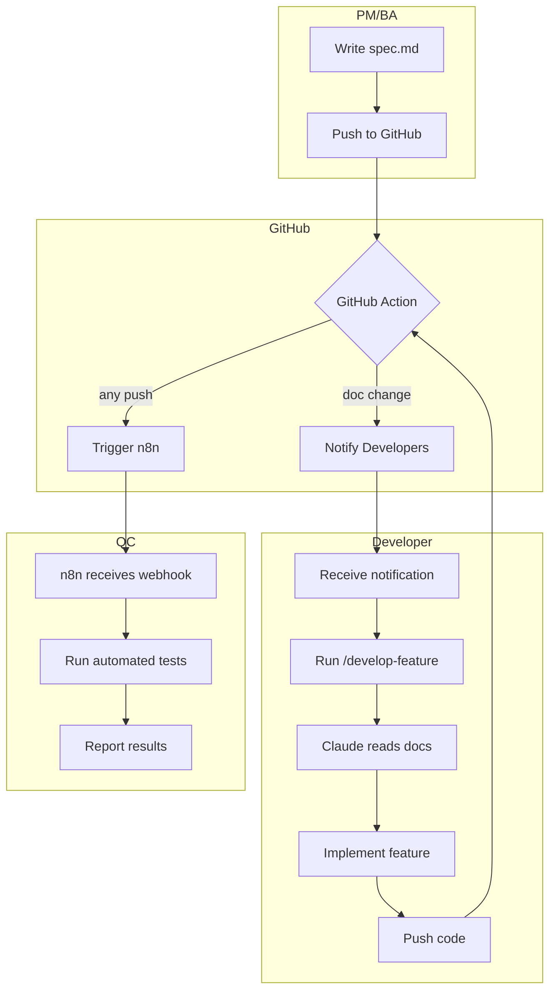
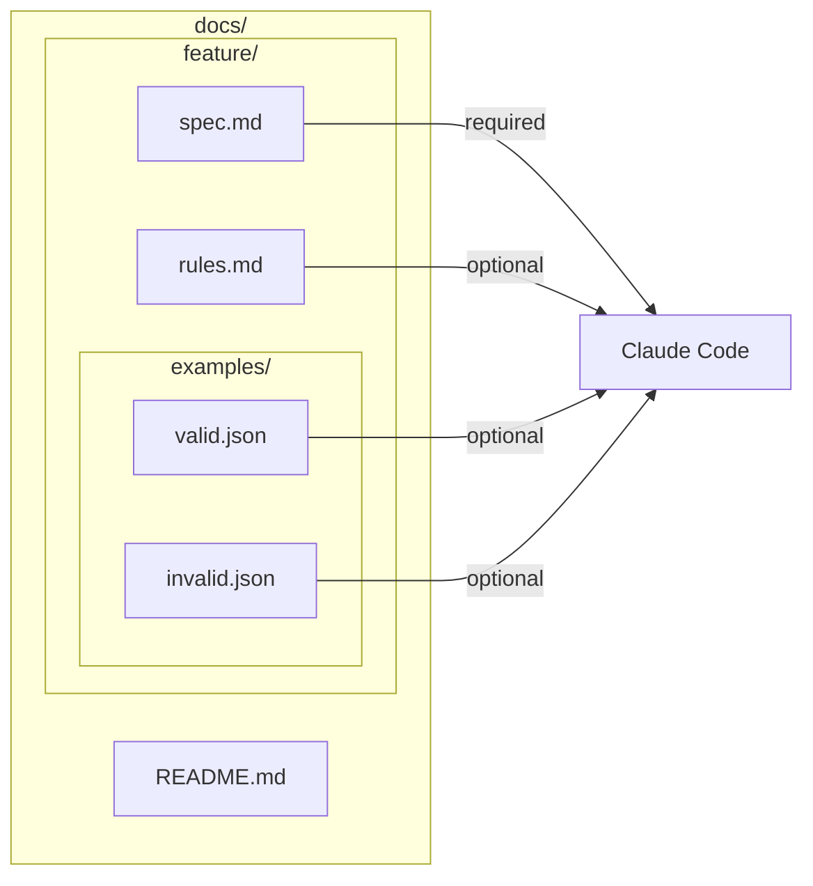
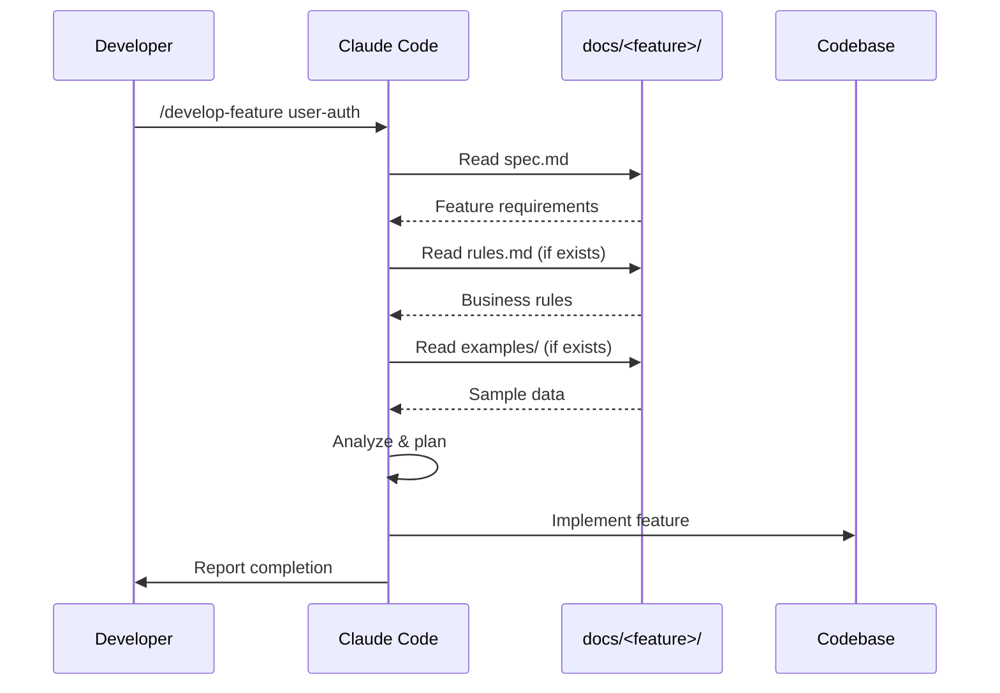
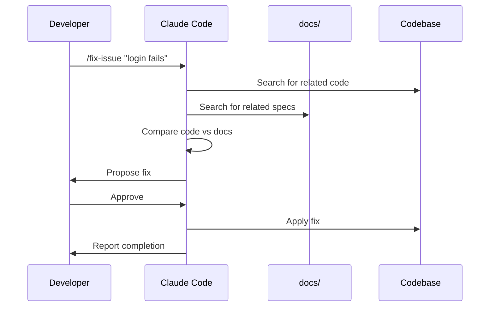
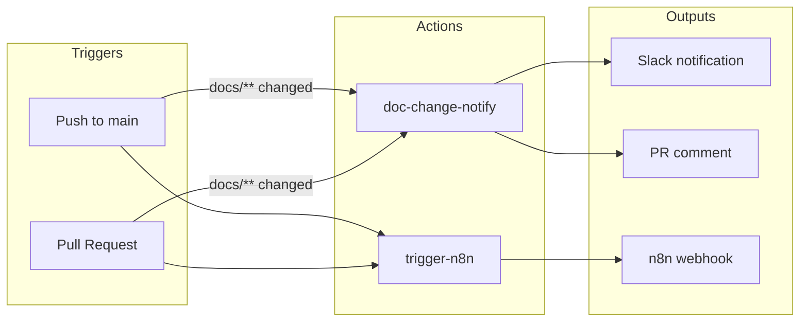
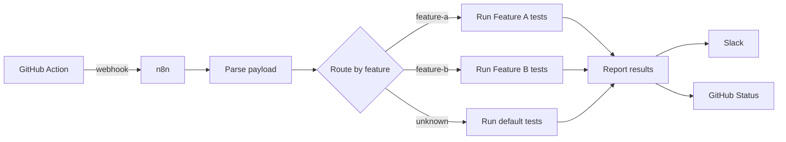

# Workflow Overview

This page visualizes the complete team workflow from documentation to deployment.

## High-Level Flow

## Documentation Structure

## Command Flow: /develop-feature

## Command Flow: /fix-issue

## GitHub Actions Flow

## n8n Integration

## File Responsibilities

| File | Owner | Purpose |
|------|-------|---------|
| `docs/<feature>/spec.md` | PM/BA | Define what to build |
| `docs/<feature>/rules.md` | PM/BA | Define business logic |
| `.claude/commands/*.md` | DevOps | Define Claude commands |
| `.github/workflows/*.yml` | DevOps | Automation workflows |
