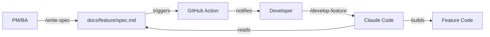

# Team Workflow

A documentation-driven development workflow connecting **PM/BA**, **Developers**, and **QC** through GitHub and Claude Code.

## Quick Start

```bash
npx create-ai-team
```

See [Installation Guide](/getting-started/installation) for details.

## How It Works



## Quick Links

| Role | Start Here |
|------|------------|
| **New Project** | [Installation](/getting-started/installation) |
| **PM/BA** | [Getting Started for PM/BA](/getting-started/for-pm-ba) |
| **Developer** | [Getting Started for Developers](/getting-started/for-developers) |

## Commands

| Command | For | Purpose |
|---------|-----|---------|
| `/write-spec` | PM/BA | Create spec through conversation |
| `/develop-feature` | Dev | Build from spec |
| `/fix-issue` | Dev | Fix bugs with context |
| `/trace-flow` | Dev | Trace code flow |

## Example Repository

See a working example: [github.com/quochuydev/workflow/tree/main/examples](https://github.com/quochuydev/workflow/tree/main/examples)

## Core Concepts

1. **Docs are source of truth** - Features are defined in `docs/<feature>/spec.md`
2. **Claude reads docs** - Commands like `/develop-feature` read specs automatically
3. **Automation everywhere** - GitHub Actions notify on changes, trigger tests via n8n
