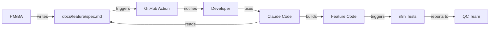

# Team Workflow

A documentation-driven development workflow connecting **PM/BA**, **Developers**, and **QC** through GitHub and Claude Code.

## How It Works

## Quick Links

| Role | Start Here |
|------|------------|
| **Developer** | [Getting Started for Developers](/getting-started/for-developers) |
| **PM/BA** | [Getting Started for PM/BA](/getting-started/for-pm-ba) |

## Core Concepts

1. **Docs are source of truth** - Features are defined in `docs/<feature>/spec.md`
2. **Claude reads docs** - Commands like `/develop-feature` read specs automatically
3. **Automation everywhere** - GitHub Actions notify on changes, trigger tests via n8n
