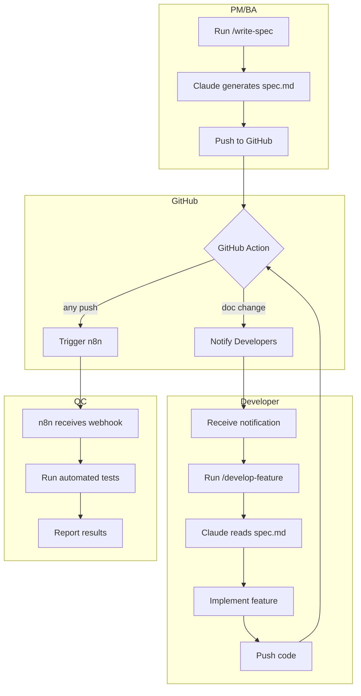
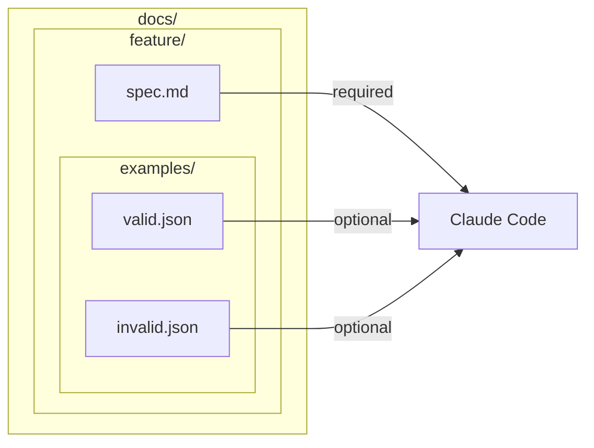
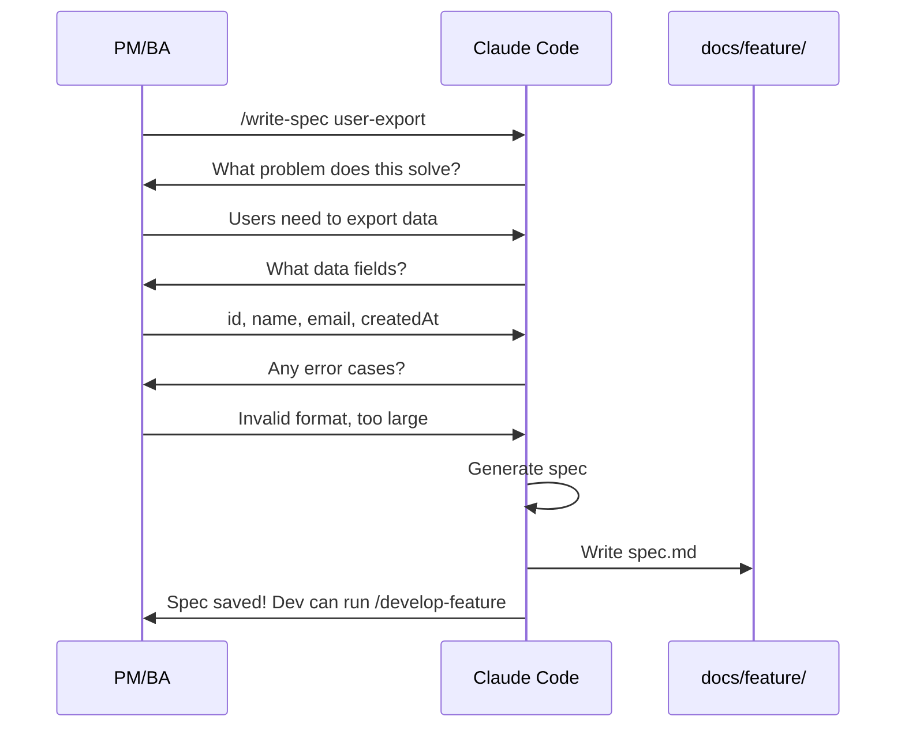
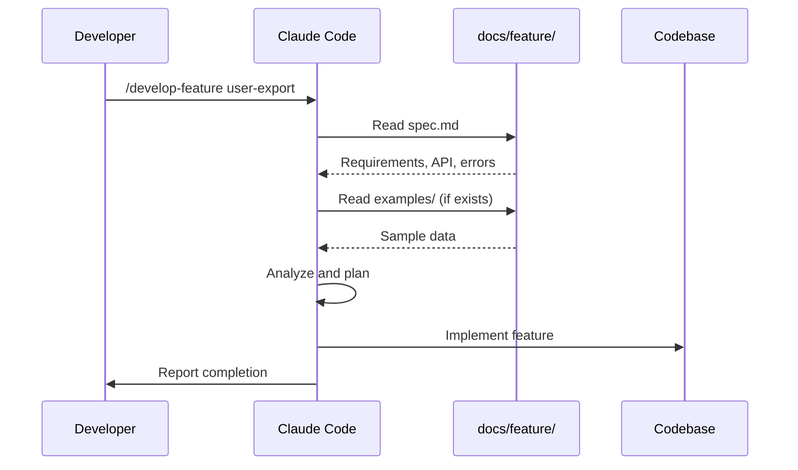
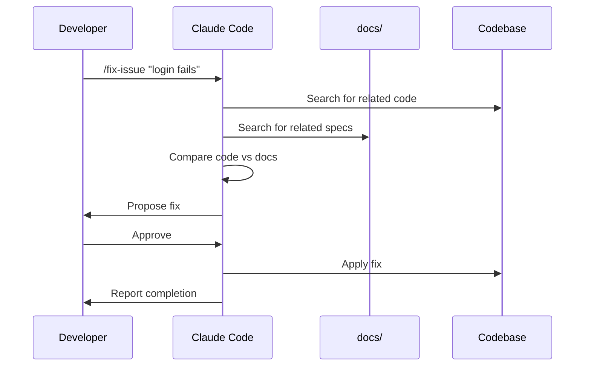
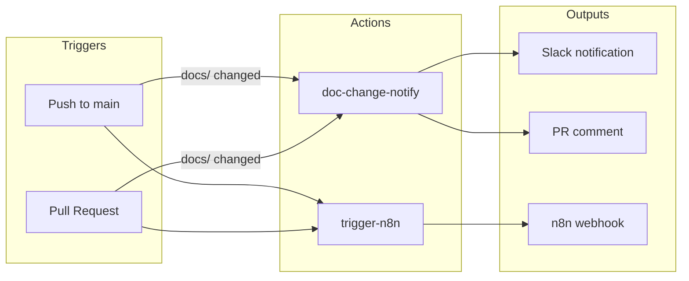
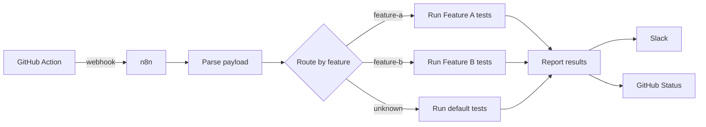

# Workflow Overview

This page visualizes the complete team workflow from documentation to deployment.

## High-Level Flow

## Documentation Structure

## Command Flow: /write-spec (PM/BA)

## Command Flow: /develop-feature (Developer)

## Command Flow: /fix-issue (Developer)

## GitHub Actions Flow

## n8n Integration

## File Responsibilities

| File | Owner | Purpose |
|------|-------|---------|
| `docs/<feature>/spec.md` | PM/BA | Define what to build (via /write-spec) |
| `docs/<feature>/examples/` | PM/BA | Sample input/output data |
| `.claude/commands/*.md` | DevOps | Define Claude commands |
| `.github/workflows/*.yml` | DevOps | Automation workflows |
