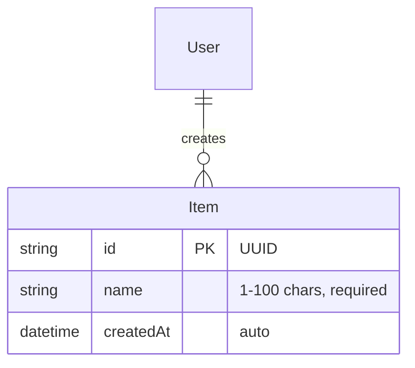

# Spec: example-feature

## Overview
Manage a list of items with CRUD operations.

## Requirements
- [ ] REQ-1: User can view list of items
- [ ] REQ-2: User can add new item
- [ ] REQ-3: User can delete existing item
- [ ] REQ-4: Items persist across page refresh

## Data Model



## API

### GET /api/items

**Response (200):**
```json
{
  "items": [
    {
      "id": "abc-123",
      "name": "Item 1",
      "createdAt": "2024-01-01T00:00:00Z"
    }
  ]
}
```

### POST /api/items

**Request:**
| Field | Type | Required | Constraints |
|-------|------|----------|-------------|
| name | string | yes | 1-100 chars |

**Response (201):**
```json
{
  "id": "abc-123",
  "name": "New Item",
  "createdAt": "2024-01-01T00:00:00Z"
}
```

### DELETE /api/items/:id

**Response (204):** No content

## Error Format

```json
{
  "code": "ERROR_CODE",
  "message": "Human readable message",
  "details": []  // optional - hints for recovery
}
```

## Error Codes

| Code | HTTP | Message | Details (optional) |
|------|------|---------|-------------------|
| NAME_REQUIRED | 400 | Name is required | `[{"field": "name"}]` |
| NAME_TOO_LONG | 400 | Name must be under 100 chars | `[{"field": "name", "max": 100}]` |
| ITEM_NOT_FOUND | 404 | Item not found | - |

## Dependencies
- `Database` - PostgreSQL or SQLite

## Constraints
- Response time: < 200ms p95
- Max items: 1000 per user

## Test Cases

| # | Input | Expected | Notes |
|---|-------|----------|-------|
| 1 | GET /api/items | 200, list | Happy path |
| 2 | POST `{"name": "Test"}` | 201, created | Happy path |
| 3 | POST `{"name": ""}` | 400, NAME_REQUIRED | Validation |
| 4 | DELETE /api/items/abc | 204 | Happy path |
| 5 | DELETE /api/items/notfound | 404, ITEM_NOT_FOUND | Not found |

## Out of Scope
- Bulk operations
- Item updates (PUT/PATCH)
- Soft delete
